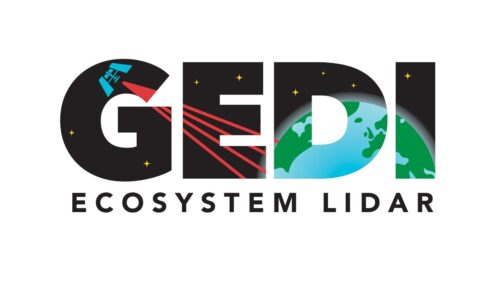
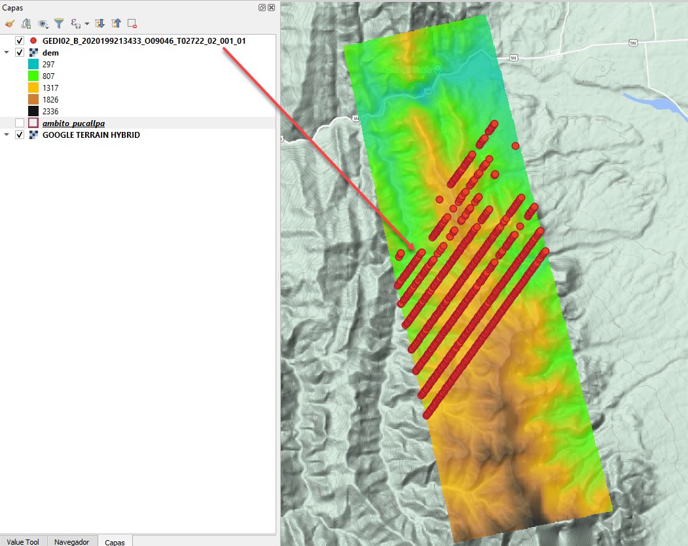
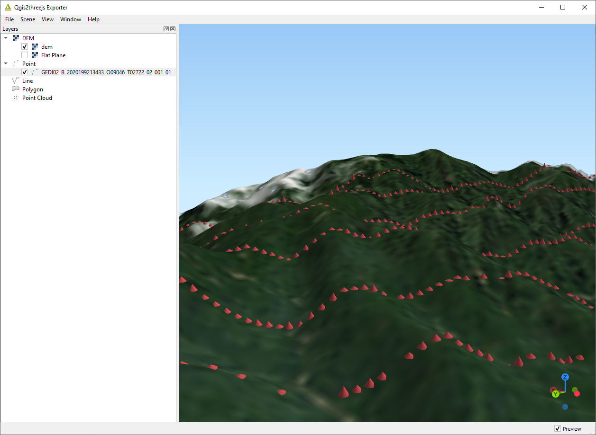

# Uso de datos Lidar GEDI

Como parte de lo presentado en una entrada de mi blog https://carbajallosa.blogspot.com/2021/03/uso-de-datos-lidar-gedi-con-qgis.html,
en este repositorio se incluye archivos que fueron empleados y que les permite reproducir el procedimiento empleado.

## Capas empleadas

Se tomó en cuenta como área de interés la selva de Perú, dentro del Departamento de Ucayali, para dicha zona se descargó 
un modelo de elevación digital (DEM), sobre el cual se cargaron los datos del producto GEDI, en esta oportunidad se usaron
los que corresponden al [GEDI02_B](https://lpdaac.usgs.gov/products/gedi02_bv001/).

En específico se trabajó con el siguiente archivo que puede ser descargado:

https://e4ftl01.cr.usgs.gov/GEDI/GEDI02_B.001/2020.07.17/GEDI02_B_2020199213433_O09046_T02722_02_001_01.h5

Cita:

Dubayah, R., Tang, H., Armston, J., Luthcke, S., Hofton, M., Blair, J. (2020). <i>GEDI L2B Canopy Cover and Vertical Profile Metrics Data Global Footprint Level V001</i> [Data set]. NASA EOSDIS Land Processes DAAC. Accessed 2021-03-22 from https://doi.org/10.5067/GEDI/GEDI02_B.001 

También se uso un plugin de QGIS denominado [Qgis2threejs](https://github.com/minorua/Qgis2threejs) para generar una vista 3D con los datos de GEDI luego de 
ser convertidos al formato geojson, para ello se usó un scrip de Python denominado [GEDI-subsetter](https://git.earthdata.nasa.gov/projects/LPDUR/repos/gedi-subsetter/browse).

